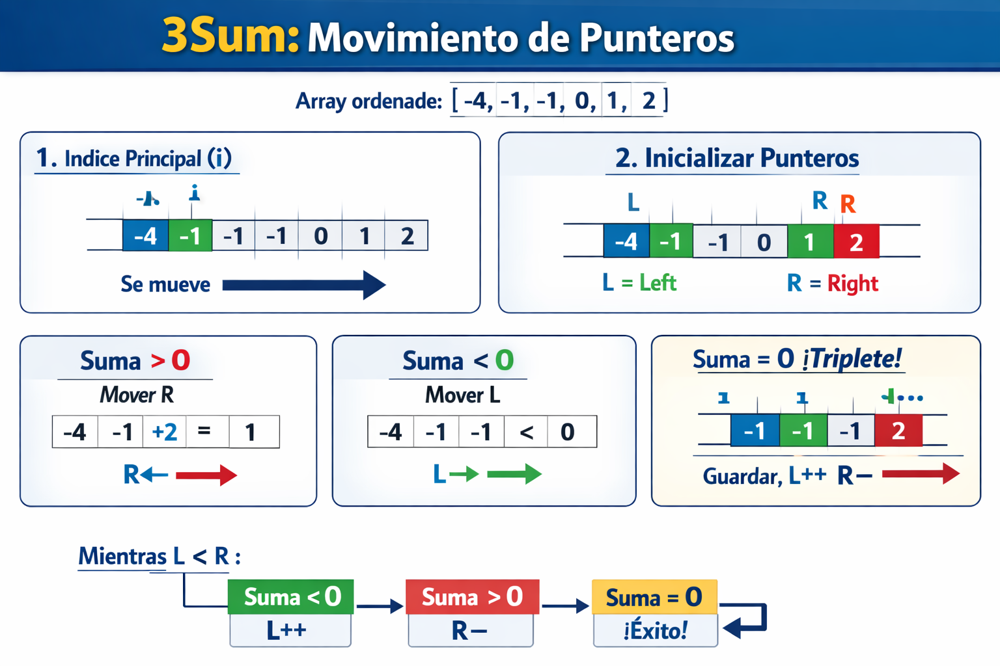

# 3Sum
Given an array of integers, find all unique triplets that sum to zero. You sort the array first, then for each element use two pointers to find pairs that complete the triplet. The sort plus two pointers bring it from O(n³) to O(n²). This problem teaches you to extend the two pointer technique beyond pairs and introduces how sorting enables smarter traversal.

## Free Resources
**article** [3Sum - LeetCode](https://leetcode.com/problems/3sum/description/)

**video** [3Sum (Updated Solution)](https://www.youtube.com/watch?v=TBePcj8DgxM)

**video** [3 Sum (LeetCode 15)](https://www.youtube.com/watch?v=cRBSOz49fQk&t=39s)

## Diagram

