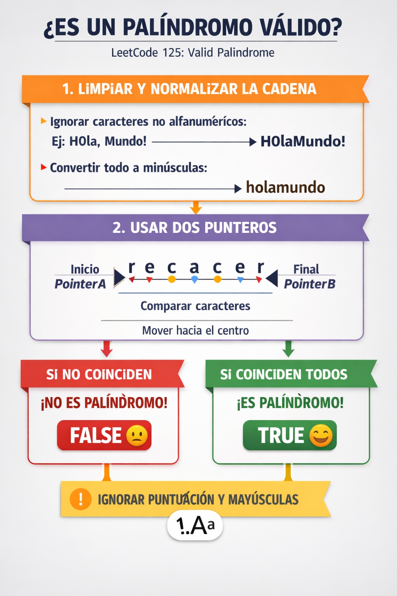

# Valid Palindrome

Given a string, determine if it reads the same forward and backwards after removing non-alphanumeric characters and ignoring case. Two pointers start at each end and move inward, comparing characters as they go. This problem teaches you to use two pointers on a string and is a clean entry point for understanding how pointers can replace nested loops.

## Free Resources

**article**  [Valid Palindrome - LeetCode](https://leetcode.com/problems/valid-palindrome/description/)

**video** [Valid Palindrome - LeetCode 125 | Two Pointers](https://www.youtube.com/watch?v=pf5RT8Oi7rk)

**video** [LeetCode Valid Palindrome](https://www.youtube.com/watch?v=rYyn9Vc-dBQ)

## Diagram

